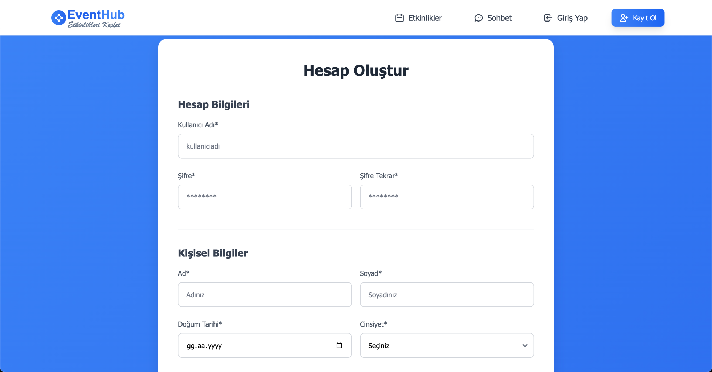
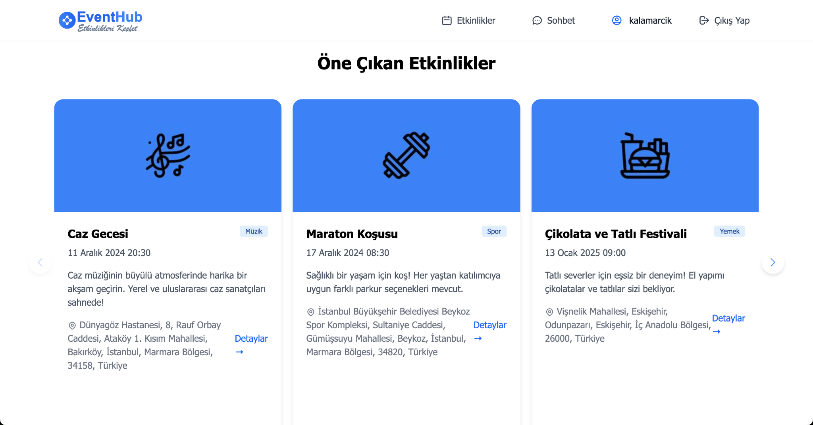
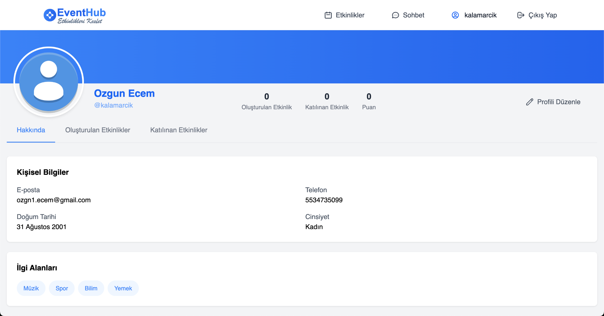
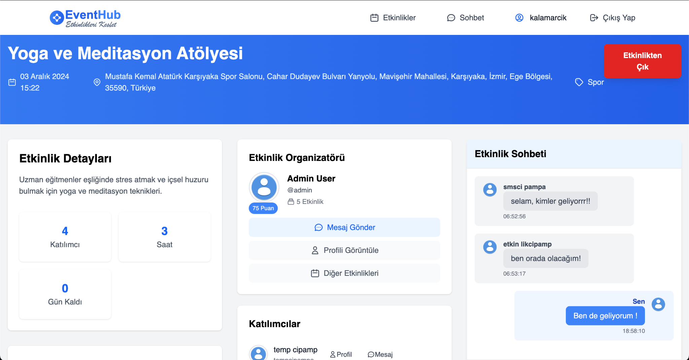
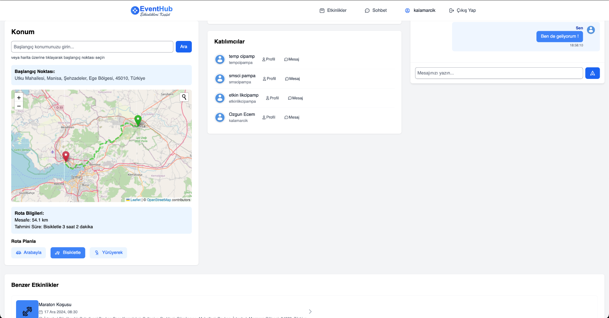
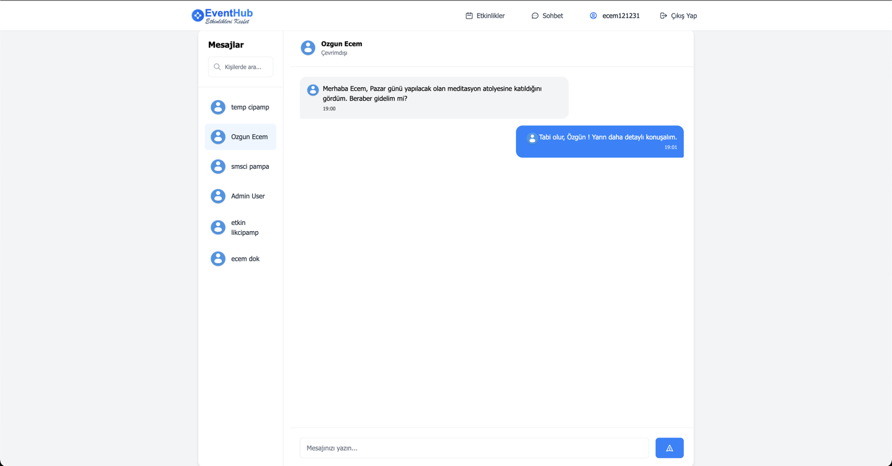
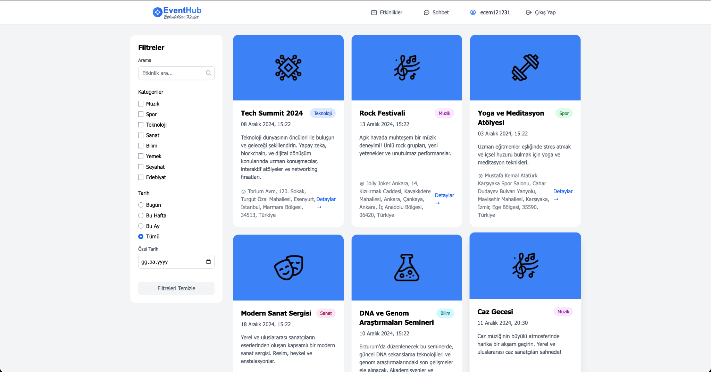

# 📍 EventHub - Etkinlik Takip ve Öneri Platformu

**EventHub**, kullanıcıların etkinlik oluşturabildiği, diğer etkinliklere katılabildiği, harita üzerinden rota planlayabildiği ve ilgi alanlarına göre öneriler alabildiği kapsamlı bir Java Spring tabanlı web uygulamasıdır.

---

## 🖼️ Uygulama Arayüzü

### 🔐 Kayıt Olma Ekranı


### 🏠 Ana Sayfa (Giriş Sonrası)


### 🙍‍♀️ Profil Sayfası


### 📅 Etkinlik Detayı Sayfası ve Sohbet Alanı


### 🗺️ Rota Planlama (Harita Üzerinden)


### 💬 Özel Mesajlaşma Paneli


### 🔍 Etkinlik Arama ve Filtreleme Paneli


---

## 🧠 Temel Özellikler

- 🔐 Kullanıcı Kaydı ve Girişi (Spring Security)
- 👥 Rol bazlı yetkilendirme (admin, user)
- 📍 Etkinlik oluşturma ve konum belirleme (Leaflet.js)
- 📦 Katılım puanı sistemi ve profil skoru
- 🗺️ Harita üzerinden rota hesaplama (OpenStreetMap + OSRM)
- 💬 Etkinlik içi sohbet & kullanıcılar arası özel mesajlaşma
- 📊 İlgi alanlarına göre öneri algoritması
- 🌐 Gerçek zamanlı konum, çevrimiçi durumu ve etkinlik önerisi

---

## 🧱 Kullanılan Teknolojiler

| Katman         | Açıklama |
|----------------|----------|
| **Java (17)** | Spring Boot ile RESTful mimari |
| **Spring Security** | Kullanıcı kimlik doğrulama ve erişim kontrolü |
| **Thymeleaf**  | Sunucu taraflı HTML şablon motoru |
| **Hibernate / JPA** | Veritabanı erişimi ve nesne haritalama |
| **Leaflet.js** | Harita ve rota planlama işlemleri |
| **OpenStreetMap** | Rota hesaplama ve harita altyapısı |
| **TailwindCSS** | Modern ve responsive kullanıcı arayüzü |
| **MySQL**      | Kalıcı veri yönetimi |
| **JavaScript** | Gerçek zamanlı mesajlaşma, filtreleme ve AJAX işlemleri |

---

## 🗂️ Proje Yapısı

```
src/
├── config/            # Spring security ve web yapılandırmaları
├── controller/        # HTTP endpointlerini yöneten katman
├── dto/               # Veri transfer nesneleri
├── entity/            # Veritabanı varlık sınıfları
├── repository/        # JPA repository arayüzleri
├── service/           # İş mantığı sınıfları (service layer)
├── static/            # JavaScript, CSS, görseller
└── templates/         # Thymeleaf HTML şablonları
```

---

## ⚙️ Kurulum

1. **Projeyi klonlayın**

```bash
git clone https://github.com/kullaniciadi/EventHub.git
cd EventHub
```

2. **MySQL veritabanınızı oluşturun**

```sql
CREATE DATABASE eventhub CHARACTER SET utf8mb4 COLLATE utf8mb4_unicode_ci;
```

3. **`application.properties` dosyasını yapılandırın**

```properties
spring.datasource.url=jdbc:mysql://localhost:3306/eventhub
spring.datasource.username=root
spring.datasource.password=1234
```

4. **Projeyi çalıştırın**

```bash
./mvnw spring-boot:run
```

5. **Uygulamayı görüntüleyin**

[http://localhost:8080](http://localhost:8080)

---

## 📚 Geliştirme & Katkı

Her türlü katkı, geri bildirim veya öneri için issue oluşturabilir ya da pull request gönderebilirsiniz.

---

## 📄 Lisans

MIT License.
